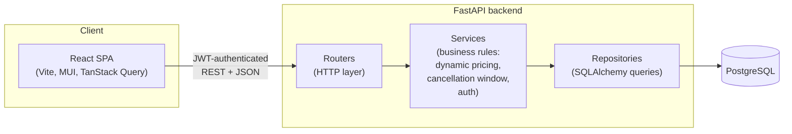

# ✈️ Flight Search

A full-stack flight search, booking, and airline-operations platform — search flights, book with
dynamic pricing, rate completed trips as a customer; manage flights, fleet, and ratings as airline
staff.

**Live demo:** _not yet deployed — see [Deployment](#deployment) below._
**API docs:** run locally and visit `http://localhost:8000/docs` for interactive Swagger docs.

Originally a Flask + MySQL + Jinja2 app, rebuilt end-to-end as a FastAPI + Postgres API with a
React + TypeScript frontend, real automated tests on both sides, and a one-command Docker Compose
setup.

## Tech stack

| Layer | Technology |
|---|---|
| Backend framework | [FastAPI](https://fastapi.tiangolo.com/) (Python 3.12) |
| Database | [PostgreSQL](https://www.postgresql.org/) via [SQLAlchemy](https://www.sqlalchemy.org/) + [Alembic](https://alembic.sqlalchemy.org/) migrations |
| Backend architecture | Layered: routers → services → repositories → models |
| Auth | JWT ([python-jose](https://github.com/mpdavis/python-jose)) + bcrypt password hashing |
| Backend tests | [pytest](https://pytest.org/), against a real Postgres test database |
| Frontend | [React 19](https://react.dev/) + [TypeScript](https://www.typescriptlang.org/) + [Vite](https://vite.dev/) |
| Component library | [MUI](https://mui.com/) (Material UI) |
| Server state / data fetching | [TanStack Query](https://tanstack.com/query) |
| Routing | [React Router](https://reactrouter.com/) |
| Forms & validation | [react-hook-form](https://react-hook-form.com/) + [Zod](https://zod.dev/) |
| Frontend tests | [Jest](https://jestjs.io/) + [React Testing Library](https://testing-library.com/react) |
| Infra | Docker Compose (API + frontend + Postgres), GitHub Actions CI |

## Architecture



Each backend layer has exactly one job — see [backend/README.md](backend/README.md) for the full
rationale and a guided tour of the code, and [frontend/README.md](frontend/README.md) for the
frontend's structure and library choices.

## Features

- **Flight search** — by city, airport name, or airport code; one-way or round trip.
- **Booking with dynamic pricing** — once a flight is ≥60% booked, price surcharges 20% above base — quoted live before payment, re-verified server-side at checkout.
- **Cancellation policy** — tickets can't be cancelled within 24 hours of departure.
- **Ratings & reviews** — customers can rate flights they've actually flown on, once each; staff see aggregated ratings.
- **Staff dashboard** — manage flights and statuses, add airports/airplanes, view ratings, and pull sales reports — all backed by the same API a customer uses, gated by role.
- **JWT auth** — role-aware (customer/staff) tokens, enforced server-side (`deps.py`) and mirrored client-side (`ProtectedRoute`) for UX.

## Getting started

### Option A: Docker Compose (recommended — one command)

```bash
docker compose up --build
```

This builds and starts Postgres, the FastAPI backend (migrations run automatically on startup),
and the React frontend served via nginx.

- Frontend: [http://localhost:8081](http://localhost:8081)
- API + docs: [http://localhost:8000/docs](http://localhost:8000/docs)

### Option B: run backend and frontend manually

<details>
<summary>Backend (FastAPI)</summary>

```bash
cd backend
pip install -r requirements.txt

# Postgres via Docker (or point DATABASE_URL at your own instance)
docker run -d --name flight_search_postgres \
  -e POSTGRES_USER=postgres -e POSTGRES_PASSWORD=postgres -e POSTGRES_DB=flights \
  -p 5432:5432 postgres:16

cp .env.example .env   # adjust DATABASE_URL/SECRET_KEY if needed
alembic upgrade head
uvicorn app.main:app --reload --port 8000
```
</details>

<details>
<summary>Frontend (React)</summary>

```bash
cd frontend
npm install
cp .env.example .env   # VITE_API_URL, defaults to http://127.0.0.1:8000
npm run dev
```

Frontend runs at `http://localhost:5173`.
</details>

## Tests

```bash
# Backend
cd backend && pytest -v

# Frontend
cd frontend && npm test
```

Both suites run against real dependencies rather than mocks where it matters — backend tests hit
a real Postgres database, and the frontend's fetch-flow test exercises real loading/error/empty
states through TanStack Query.

## CI

Every push and pull request to `main` runs backend tests (pytest against a Postgres service
container), and frontend lint + typecheck + tests + build, via GitHub Actions
(`.github/workflows/ci.yml`).

## Deployment

Not yet deployed. Planned: FastAPI on Render/Railway, React on Vercel, managed Postgres — this
section will be updated with the live URL once that's set up.

## Project structure

```
flight_search/
├─ backend/          # FastAPI app - see backend/README.md
├─ frontend/         # React app - see frontend/README.md
├─ docker-compose.yml
├─ .github/workflows/ci.yml
├─ app/              # legacy Flask app (superseded by backend/ + frontend/, kept for reference)
└─ run.py            # legacy Flask entrypoint
```

## License

[MIT License](LICENSE).
